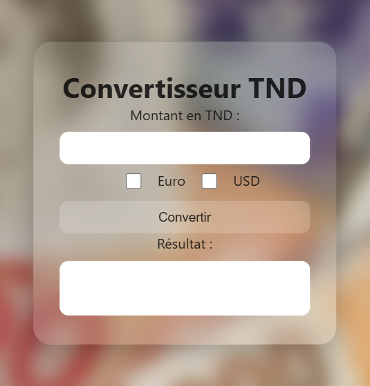

# Convertisseur de Money

## Description

Il ya 4 exemple de convertisseur de money
- [exemple 1 avec des boutons](./exemple1/)
### Capture d'écran
    

- [exemple 2 avec des boutons radios](./exemple2/)
### Capture d'écran
    

- [exemple 3 avec un menu deroulant](./exemple3/)
### Capture d'écran
    

- [exemple 4 avec des boutons checkbox et textarea](./exemple4/)
### Capture d'écran
    

## Langages utilisés

- HTML
- CSS
- JS

